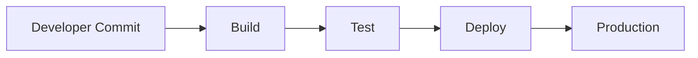

### Stwórz prosty diagram Mermaid pokazujący proces CI/CD: commit → build → test → deploy.

Jasne! Oto prosty diagram Mermaid ilustrujący proces CI/CD:

markdown
Copy
Edit

📌 Co przedstawia:

A – programista wykonuje commit (np. push do Git)

B – pipeline buduje aplikację (np. Jenkins, GitHub Actions)

C – uruchamiane są testy automatyczne (unit/integration)

D – jeśli testy przejdą, kod jest wdrażany

E – aplikacja trafia na produkcję

mermaid:
